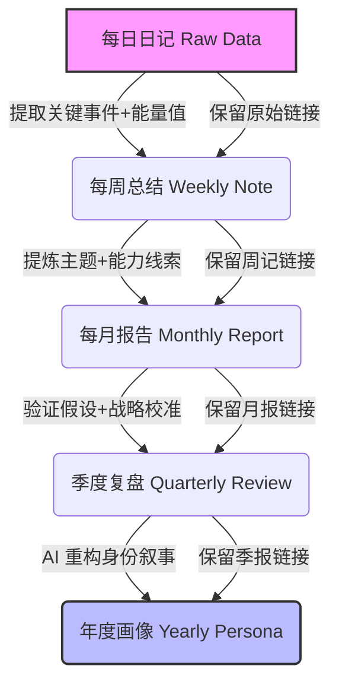

## 0. 目标与边界

> [!info] 核心目标
> 维护 `Calendar/` 目录，基于多模态日记数据，构建我的**个人数字画像**，通过量化行为模式与情感轨迹，深度解析我的核心特质。”

- **目标**：你负责维护本仓库中的 `Calendar/` 目录，把它变成一个关于记录我成长的记忆库
- **边界**：
  - 原始资料（`Calendar/Journal/Daily`）是唯一事实来源，**只读不改**
  - 只在 `Calendar/` 里创建、修改 Markdown 页面
---

## 1. 目录结构约定

### 原始资料层（Raw）

- `Calendar/Journal/Daily`：原始资料（每日日记），**只读**

### Calendar 维护层

`Calendar/Journal/` 由你维护，建议子目录：

| 目录                            | 周期    |
| ----------------------------- | ----- |
| `Calendar/Journal/weekly/`    | 每周    |
| `Calendar/Journal/monthly/`   | 每月    |
| `Calendar/Journal/quarterly/` | 季度    |
| `Calendar/Journal/Yearly/`    | 年度总结  |
| `Calendar/Insights/`          | 洞察瞬间  |
| `Calendar/Mental_Models/`     | 思维模型  |
| `Calendar/人物社交圈/`             | 人物社交圈 |

### 根目录文件

- `Calendar/index.md`：内容索引（可选，用 Obsidian 视图替代也行）
- `Calendar/log.md`：操作日志
---
## 2. 页面类型与基本格式

所有 Calendar 页面使用 Markdown，顶部 frontmatter 示例：

```yaml
---
type: "weekly|monthly|quarterly|Yearly"
tags: ["tag1", "tag2"]
summary: "一句话说明这页的核心内容"
sources: ["Calendar/Journal/Daily/YYYY-MM-DD.md"]
updated: "2026-04-13"
energy_avg:[7]  # 本周平均能量值（1-10)
energy_highlow: "最高：2026-04-11（8分，原因：xxx）；最低：2026-04-12（5分，原因：xxx）" # 直接提取周记核心数据
```

### 2.1 Weekly Note（每周总结）

路径：`Calendar/Journal/weekly/YYYY-Www.md`  示例：`2026-W15.md`

- **能量统计**：本周平均能量、最高/最低能量日及原因。
- **高频 Themes**：本周出现最多的3个标签。
- **关键事件列表**：引用原始日记链接 `[[2026-04-14]]`，简述事件。
- **待观察信号**：AI 标记出的“疑似能力点”或“异常情绪”，**必须附带原始日记引用**。

### 2.2 Monthly Report（每月报告）

路径：`Calendar/Journal/monthly/yyyy-mm.md` 等

- **主流模式**：基于4周周报的主题聚类。
- **异常值报告（Outliers）**：哪一周的能量/主题与其他周显著不同？为什么？（例如：第三周突然出现了大量“创造”主题，而其他周都是“执行”）。
- **假设验证进度**：本月对某个“能力点”的测试结果是支持还是反对？
- 来自哪些来源（列出 `weekly`）

### 2.3  Quarterly Review （季度复盘）

路径：`Calendar/Journal/quarterly/YYYY-[Q]Q.md` 等

-  **趋势线图**：基于月度数据的能量/主题变化趋势。
- **核心结论**：关于支点和能力的最终判断。
- **置信度评级**：AI 需标注每个结论的置信度（高/中/低）。
        *   *高*：多个月份数据一致支持。
        *   *低*：数据稀疏或矛盾，**建议人工查阅原始月份笔记**。

### 2.4 Yearly Persona（年度画像）

路径：`Calendar/Journal/Yearly/yyyy.md`

- 绘制年度情绪与主题演变轨迹。
- 确认最终的“人生支点”和“核心能力”
- **偏差校正机制**：如果某个月的结论与其他月份冲突，请明确指出矛盾点，并建议我回顾哪几个月的原始周记以获取真相。
- 输出下一年度的战略建议。

---

### 3.工作流：
> 角色设定：你是一位擅长**计算心理学**与**行为数据分析专家**。
> 任务目标：请基于我提供的周期性日记数据，执行**“个人数字画像构建”**任务。

#### 📐 推荐架构：金字塔存储结构


### 3.1 Star （开始）
当我说”请基于 `Calendar/Journal/Daily/xxx` 进行 每周总结”时：

1. 阅读 `Calendar/Journal/Daily/xxx`，按页面格式提炼内容。
2. 根据iso 8601标准，在 `Calendar/Journal/weekly/` 新建或更新周报（日期与周要严格对应）
3. 根据内容更新或创建：
   - 洞察瞬间（`Calendar/Insights`）
   - 思维模型（`Calendar/Mental_Models`）
   - 人物（我花精力去了解的人物，将其身份信息创建实体页面`Calendar/人物社交圈`)
4. **模板更新（新增）**：
   - 读取当前日记模板（`Calendar/日记模板.md`）
   - 提取周报中的”下周建议”部分
   - 将战略建议转换为可执行的待办事项格式
   - 在energy: 内容前插入战略建议部分
   - 在 `Calendar/log.md` 追加记录：
     ```
     ## [2026-04-30] calendar | W17周报战略建议 → Calendar/日记模板.md (v26.52)
     ```
5. 维护索引 / Log：
   - 在 `Calendar/index.md` 补上新页面条目（标题、链接、一句话 summary）
   - 若缺失某天：在 Log 中记录警告，但不中断流程。
   - 在 `Calendar/log.md` 追加记录：
     ```
     ## [2026-04-08] report | Calendar/Journal/Daily/xxx → Calendar/Insights/xxx.md (+ affected pages)
     ```
  >  **💡 防偏差**：周笔记中**必须保留指向原始日记的双向链接**。这样当你在看周报时，可以随时点击跳转回当天，查看原汁原味的记录。

6. **行动闭环生成**（核心增量）
   - **能量-行为-结果关联**：识别能量波动与行为模式的关联，提取可验证的假设
   - **主题成长属性分类**：将高频主题分类为「输入类/输出类/执行类/反思类」，分析成长结构是否失衡
   - **成长信号 + 干预建议**：对每个待观察信号，附带72小时内可执行的具体行动建议

### 3.2 Star-Monthly （月度总结）
当我说”请生成X月份月报”时：

1. **数据收集**
   - 检查当月所有周报（`Calendar/Journal/weekly/`）
   - 统计数据完整度，缺失数据在月报和`Calendar/log.md`中明确标注

2. **周报补全检查**
   - 若当月最后一周（跨月周）无周报但有日记：先调用 3.1 Star 工作流生成周报
   - 月报依赖完整周报层级数据

3. **跨月周归属规则**（重要）
   - 跨月周按该周**第1天**的月份归属
   - 示例：W18 第1天为04-27（周一）→ 归属4月月报；W19 第1天为05-04 → 归属5月月报
   - 月报生成后，sources 中的周报路径锁定
   - 若周报后续有重大更新，月报不会自动同步；用户可选择是否刷新月报(补充：“重大更新指周报中能量统计、高频主题、关键事件、行动闭环等核心字段的修改”)
   - **数据版本说明**：在月报 frontmatter 中记录 `sources_updated`，便于追溯

4. **月度汇总分析**
   - 能量统计：计算当月平均能量、周度能量趋势、异常值
   - 主题聚类：汇总当月3个高频主题及其变化
   - **学习循环分析**：判断当前处于「输入期→消化期→输出期→反思期」的哪个阶段，识别循环断裂
   - **归因分层**：对异常值区分「环境异常（不可控）/ 策略异常（可控）/ 动机异常（可控）」

5. **行动闭环追踪**（核心增量）
   - **上月行动执行情况**：追踪上月提出的”可执行行动”的完成率，分析未完成原因
   - **策略有效性验证**：基于数据验证上月测试的策略是否有效（如”晨间写作完成度80% > 晚间30%”）
   - **本月新干预设计**：针对反复出现的行为模式，设计具体干预策略和工具

6. **月度汇总与模板整合（新增）**：
   - 读取当前日记模板（`Calendar/日记模板.md`）
   - 提取月报中的”下月目标”或”战略建议”部分
   - 将月度战略建议插入到周报建议之上
   - 在 `Calendar/log.md` 追加记录：
     ```
     ## [2026-04-30] calendar | 2026-04月报战略建议插入 → Calendar/日记模板.md (v26.53)
     ```

7. **月报生成**
   - 按 `Calendar/Journal/monthly/yyyy-mm.md` 路径创建月报
   - 保留当月所有周报的引用链接
   - 标注数据缺失（如有）

8. **洞察与模型更新**
   - 若当月有新的跨周洞察/模式：在 `Calendar/Insights/` 或 `Calendar/Mental_Models/` 创建页面

8. **维护索引 / Log**
   - 在 `Calendar/index.md` 补上月报条目
   - 在 `Calendar/log.md` 追加记录：
     ```
     ## [2026-04-30] monthly | 2026-04 月报生成 → Calendar/Journal/monthly/2026-04.md
     ```
   - **成长亮点记录**：从本月提取1-2个”小进步”写入 `Calendar/log.md` 的「成长亮点」模块

### 3.3 Star-Quarterly（季度复盘）
当我说”请生成XXXX年Q[数字]季度复盘”时：

1. **数据收集**
   - 检查该季度内所有月报（`Calendar/Journal/monthly/`）
   - 验证数据完整性：缺失月份在复盘中标注警告

2. **月度补全检查**
   - 若某月无月报但有周报：先调用 3.2 Star-Monthly 工作流生成月报
   - 季度复盘依赖完整月度数据

3. **季度汇总分析**
   - **能量趋势分析**：计算季度平均能量，绘制月度能量变化曲线
   - **主题演变分析**：对比3个月的主题聚类，识别迁移模式
   - **假设验证闭环**：汇总该季度所有”假设验证进度”，给出最终判断
   - **关键决策追踪**：本季度做出的战略决策及其执行反馈
   - **能力支点评估**：基于3个月数据对各能力支点评分（高/中/低置信度）

4. **转化率评估**（核心增量）
   - **成长指标联动分析**：分析”能量值””刻意练习时长””成长型归因比例””输入-输出占比”的联动关系，识别核心驱动因素
   - **认知-行为转化率**：评估”知道”到”做到”的转化效率（如”踏实感来自小事”的认知已转化为多少天的持续行动）
   - **干预策略有效性评估**：评估上季度设计的干预策略是否有效

5. **季度汇总与模板校准**：
   - 读取当前日记模板（`Calendar/日记模板.md`）
   - 提取季度复盘中的”战略调整建议”和”长期方向”
   - 将季度战略建议添加到日记模板的战略层级
   - 在 `Calendar/log.md` 追加记录：
     ```
     ## [2026-06-30] calendar | 2026-Q2季度战略校准 → Calendar/日记模板.md (v26.54)
     ```

6. **季度复盘生成**
   - 路径：`Calendar/Journal/quarterly/YYYY-[Q]Q.md`
   - 保留所有月报的引用链接
   - 标注数据缺失（如有）

7. **战略校准输出**
   - 根据季度数据，提出下季度战略调整建议
   - **核心结论行动化**：每个结论必须附带具体的、可执行的下一步行动
   - 识别需要人工介入的”低置信度”结论，并给出数据采集建议

8. **维护索引 / Log**
   - 在 `Calendar/index.md` 补上季度复盘条目
   - 在 `Calendar/log.md` 追加记录：
     ```
     ## [2026-06-30] quarterly | 2026-Q2 复盘生成 → Calendar/Journal/quarterly/2026-Q2.md
     ```

### 3.4 Star-Yearly（年度画像）
当我说”请生成XXXX年年度画像”时：

1. **数据收集**
   - 检查该年度所有季度复盘（`Calendar/Journal/quarterly/`）
   - 验证数据完整性：缺失季度在画像中标注警告

2. **季度补全检查**
   - 若某季度无复盘但有月报：先调用 3.3 Star-Quarterly 工作流生成
   - 年度画像依赖完整季度数据

3. **年度深度分析**

   #### 3.4.1 身份叙事重构
   - **年度轨迹绘制**：基于季度能量数据，绘制年度情绪与主题演变曲线
   - **人生支点确认**：从4个季度的能力支点评估中，提炼最终结论
   - **核心能力确认**：结合高频主题和成功事件，识别反复出现的能力模式

   #### 3.4.2 差异分析 + 认知失调缓解（核心增量）
   - 对比”我自以为的我”与”数据呈现的我”
   - 识别认知偏差点，标注具体矛盾证据
   - **认知失调缓解方案**：每个偏差需附带具体的”修复动作”
   - 格式：
     ```
     | 自以为 | 数据呈现 | 偏差类型 | 失调缓解方案 |
     |--------|----------|----------|--------------|
     | 自律型 | 拖延型 | 高估自律能力 | 1. 拆解≤30分钟任务；2. 引入打卡机制 |
     ```

   #### 3.4.3 偏差校正机制 + 认知重构引导
   - 检测季度复盘间的矛盾结论
   - 明确标注矛盾点，建议查阅的具体原始笔记
   - **认知重构引导**：对矛盾点给出”提问清单”，引导自我澄清
   - 格式：
     ```
     ⚠️ 矛盾点：[Q2说A，Q3说B]
     📖 建议回溯：Calendar/Journal/monthly/2026-05.md, Calendar/Journal/monthly/2026-08.md
     💭 认知重构提问：
     1. 两个季度的场景是否不同？
     2. 创作前的输入是否充足？
     3. 对”创作力”定义是否一致？
     ```

   #### 3.4.4 年度关键决策评估 + 决策质量框架
   - 回顾该年度所有重大决策
   - **决策质量评估**：从”决策依据（数据/直觉）””执行过程（策略适配）””结果反馈（达成度）””复盘迭代（是否调整）”四维度评估

4. **年度汇总与模板重置（新增）**：
   - 读取当前日记模板（`Calendar/日记模板.md`）
   - 提取年度画像中的"下一年度战略建议"
   - 重置日记模板的战略建议部分，添加年度身份宣言
   - 在 `Calendar/log.md` 追加记录：
     ```
     ## [2026-12-31] calendar | 2026年度模板重置 → Calendar/日记模板.md (v27.01)
     ```

5. **年度成长算法提炼**（核心增量）
   - 基于数据提炼个人专属的成长公式
   - 格式：
     ```
     触发条件 + 行动 + 反馈机制 = 成长
     示例：焦虑(能量<5) + 完成小事(5分钟) + 记录能量 → 踏实感回归
     ```

6. **年度画像生成**
   - 路径：`Calendar/Journal/Yearly/yyyy.md`
   - 保留所有季度复盘的引用链接
   - 标注数据缺失（如有）

7. **下一年度战略建议**
   - 基于年度数据，提出3-5条可执行的新年度目标
   - 区分”维持项”（继续保持的好习惯）、”改进项”（需要突破的弱点）、”挑战项”（远期目标）

8. **下一年度身份宣言**（核心增量）
   - 从”数据验证的我是谁”升级为”行动验证的我将成为谁”
   - 基于成长算法的”身份叙事升级”

9. **维护索引 / Log**
   - 在 `Calendar/index.md` 补上年度画像条目
   - 在 `Calendar/log.md` 追加记录：
     ```
     ## [2026-12-31] yearly | 2026年度画像生成 → Calendar/Journal/Yearly/2026.md
     ```

### 3.5 版本号管理规则

#### 版本号命名规则：
- 格式：`年份缩写.数字`（如：26.52）
- 年份更新后数字不重置（26.52 → 27.53）
- 每次模板更新数字加一

#### 版本记录位置：
- 仅在 `Calendar/log.md` 中记录模板更新
- 格式：`## [日期] calendar | 描述 → Calendar/日记模板.md (v版本号)`

#### 版本控制原则：
- 保持单一日记模板文件
- 每次报告生成时自动更新模板
- 版本记录用于Lint健康检查和流程追溯

### 3.6 Lint（健康检查）

当我说”请做一次Lint”时，你对`Calendar/`目录按以下机制执行全面检查：
#### 3.6.1层级检查矩阵

| 检查维度 | 周报 | 月报 | 季报 | 年报 | 洞察/模型 |
|----------|:----:|:----:|:----:|:----:|:---------:|
| 数据完整性 | ✅ | ✅ | ✅ | ✅ | — |
| 结构完整性 | ✅ | ✅ | ✅ | ✅ | ✅ |
| 双向链接 | ✅ | ✅ | ✅ | ✅ | ✅ |
| 行动闭环 | ✅ | ✅ | ✅ | ✅ | — |
| 认知偏差 | ✅ | ✅ | ✅ | ✅ | — |

#### 3.6.2检查维度详细说明

**A. 数据完整性检查**
- 缺失的日记/周报/月报文件
- 数据引用是否都有原文链接
- frontmatter信息是否完整（type, tags, sources, updated等）

**B. 结构完整性检查**
- 必要板块是否齐全（如周报的”能量统计””高频Themes””行动闭环”）
- 必要字段是否存在（energy_avg, summary等）

**C. 双向链接健康**
- 孤立页面（无入链也无出链）
- 断链检测（链接目标是否存在）
- 出链统计（每个报告引用了哪些原始数据）

**D. 行动闭环完整性**
- 上月行动建议是否被追踪（执行/未执行）
- 策略有效性验证是否有结论
- 72小时内可执行行动是否具体可操作

**E. 认知偏差检测**
- 自述与数据是否矛盾
- 归因类型是否合理（避免过度环境归因）
- 重复出现的模式是否被识别
#### 3.6.3输出格式

```markdown
## Lint报告

### 🔴 高优先级
1. [缺失] Calendar/Journal/monthly/2026-05.md 缺失
2. [断链] [[Calendar/Journal/Daily/2026-05-01]] 目标不存在
3. [结构] 周报结构不完整缺少生成"思维模型_刻意练习"页面

### 🟡 中优先级  
1. [孤立] Calendar/Insights/洞察_X.md 无入链
2. [结构] 2026-W20.md 缺少”行动闭环”板块

### 🔵 低优先级
1. [优化] 多个洞察的summary可更具体
2. [建议] 可考虑为”思维模型_刻意练习”添加应用场景

### 📊 统计概览
- 周报完整率：4/5 (80%)
- 月报完整率：2/3 (67%)
- 孤立页面：1个
- 待追踪行动：3个
```
#### 3.6.4 执行流程

1. **扫描**：按层级执行检查矩阵，记录所有问题
2. **分级**：按优先级（🔴🟡🔵）分类问题
3. **生成建议清单**：**不直接大改**，列出所有问题供确认
4. **确认后执行**：经用户确认后再动手修改
5. **记录到 `Calendar/log.md`**：
   ```
   ## [2026-04-14] lint | 发现3个🔴、2个🟡、5个🔵问题 → 已修复
   ```
6. **动机维护**：在 `Calendar/log.md` 的「成长亮点」模块中，提取本周/月的1-2个”小进步”

---
## 4. 约定与风格

> [!tip] 操作原则
> 不确定时，先提议再执行，不做大规模自动改动

- 页面命名：除报告按对应日历规则命名外，中文 + 下划线，稳定可读（如 `洞察_事先预期`）
- 内部链接：使用 Obsidian `[[wikilink]]` 语法
- 不确定时：先提议”创建/修改哪些页面”，由我确认后再执行

### 4.1 工具选择

当需要查找笔记间的关系时，**优先使用 obsidian-cli skill**：

- Wiki links（双向链接）查询
- Tags 或带特定 tags 的笔记搜索
- Frontmatter 信息提取
- 笔记之间的相互关系梳理与分析

> [!note] 为什么用 obsidian-cli
> obsidian-cli 专门针对 Obsidian 的元数据和链接结构优化，比通用的文本搜索更精确高效

---
**“本系统的核心目标是：通过持续采集与分析用户的日记数据，构建动态更新的‘个人数字画像’，旨在帮助用户从客观数据视角发现隐藏的能力优势、核心价值支点及认知盲区。”
*差异分析**：对比“我自以为的我”与“数据呈现的我”（实际行为/能量值），指出认知偏差。
**输出要求**：请用客观、第三视角的口吻，生成一份《[时间段] 个人数字画像分析报告》。

