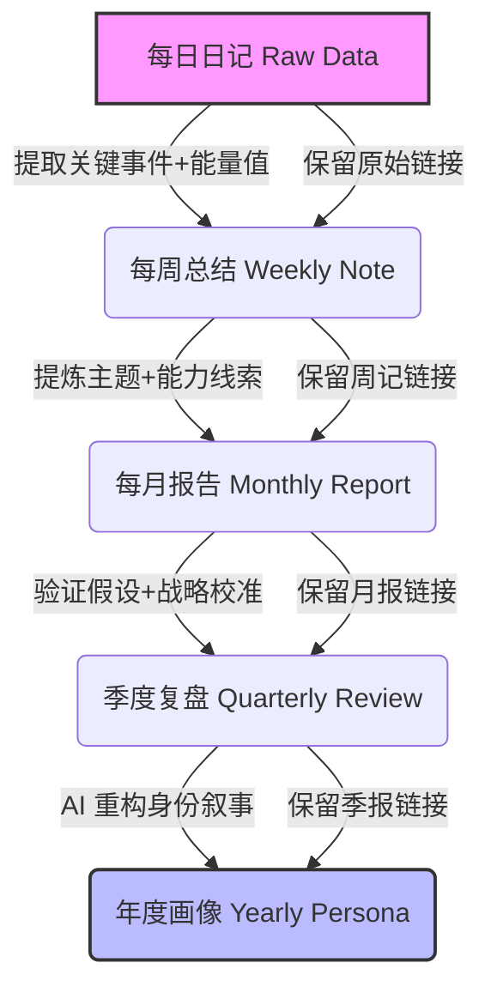

# pore-skill  基于 Obsidian 的日记管理系统  

## 核心理念  
基于多模态每日日记原始数据，以计算心理学和行为数据分析为方法，构建动态更新的个人数字画像，通过客观数据量化行为模式、情感轨迹，发现能力优势、认知盲区，校准自我认知，最终沉淀核心特质与成长方向。  
---
```
AI-Diary-Management-System/    #目录层级
Calendar/                       # 日历日记总库  
├── schema.md                 # 日记格式规范&AI生成规则文件  
├── Journal/                  # 日记归档主目录  
│   ├── Daily/                # 每日日记  
│   ├── Weekly/               # 每周复盘  
│   ├── Monthly/              # 每月总结  
│   ├── Quarterly/            # 季度复盘  
│   └── Yearly/               # 年度总结  
├── Insights/                 # 洞察瞬间/灵感感悟  
├── Mental_Models/            # 思维模型认知沉淀  
└── Social_Circle/            # 人物社交圈档案
```
---
核心特性  
1.数据只读不篡改：原始日记为唯一事实来源，仅基于其加工衍生内容；  
2.闭环化行动导向：各周期报告均提炼可执行行动建议，追踪执行效果并迭代策略，且关联能量 - 行为 - 结果，验证成长假设；  
3.多层级偏差校正：对比 “自认知” 与 “数据呈现” 的偏差，标注矛盾点并给出校正方案；  
4.模板动态迭代：各周期报告结论反哺日记模板，按版本号管理更新；  
5.全链路可追溯：所有衍生报告保留原始 / 上游数据双向链接，日志记录全操作，支持健康检查（Lint）校验完整性。  
---
金字塔存储结构：  


